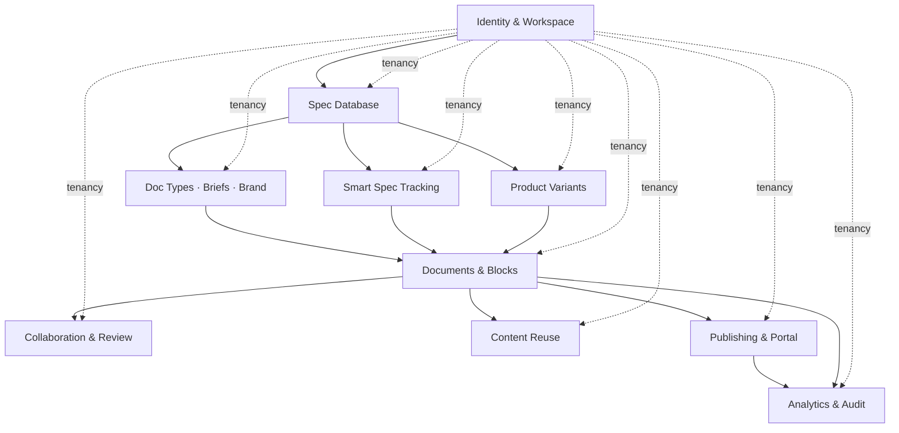
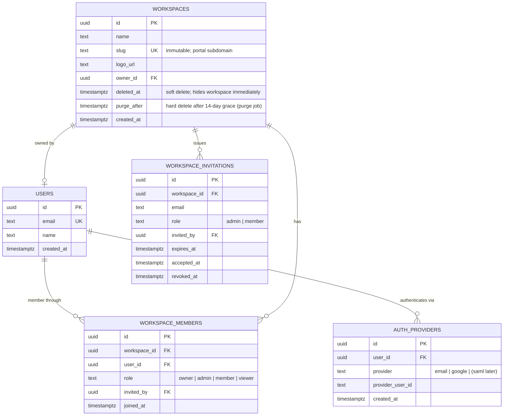
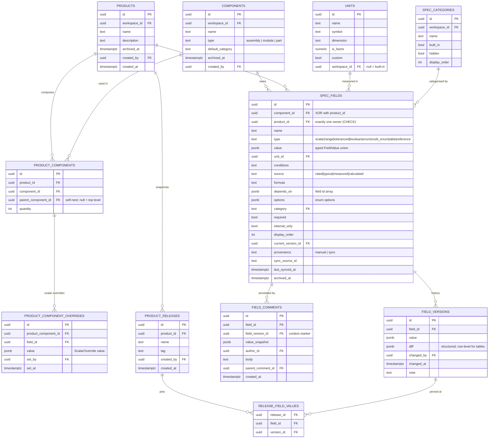
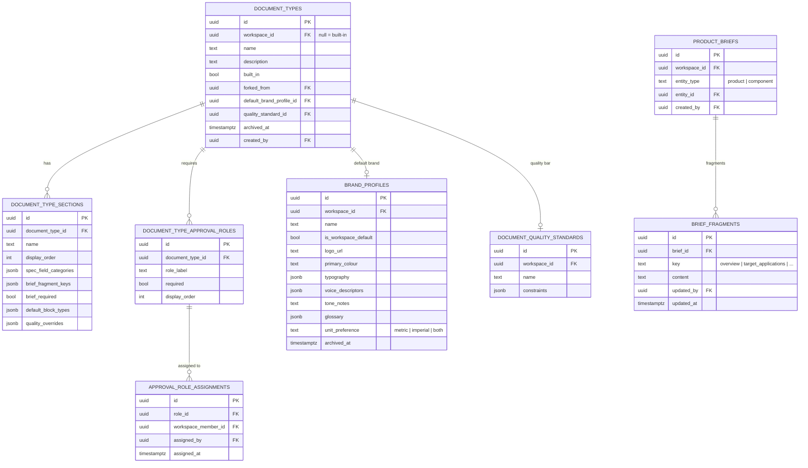
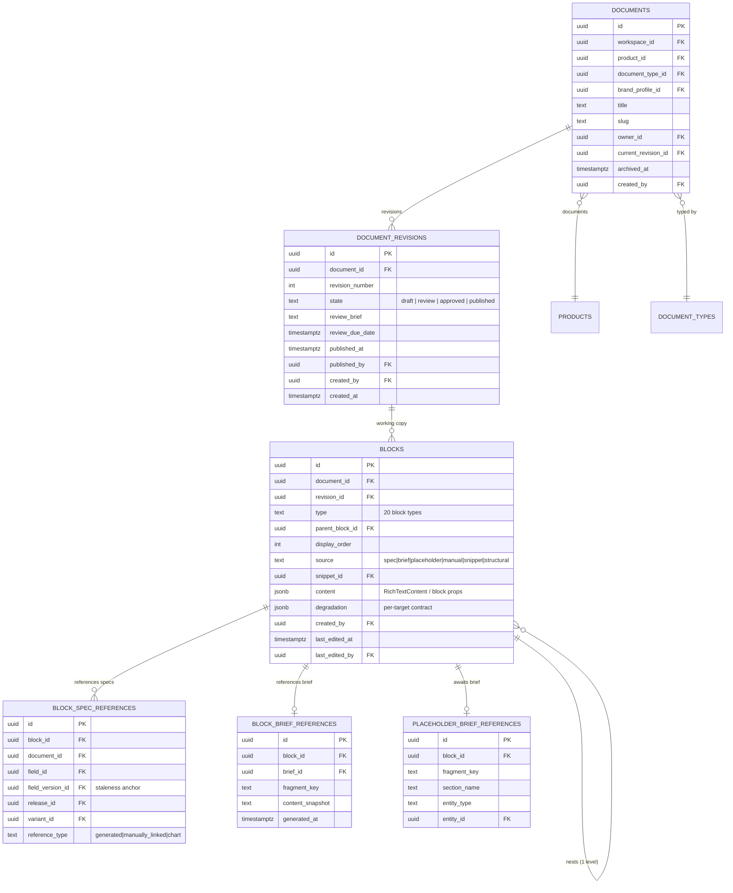
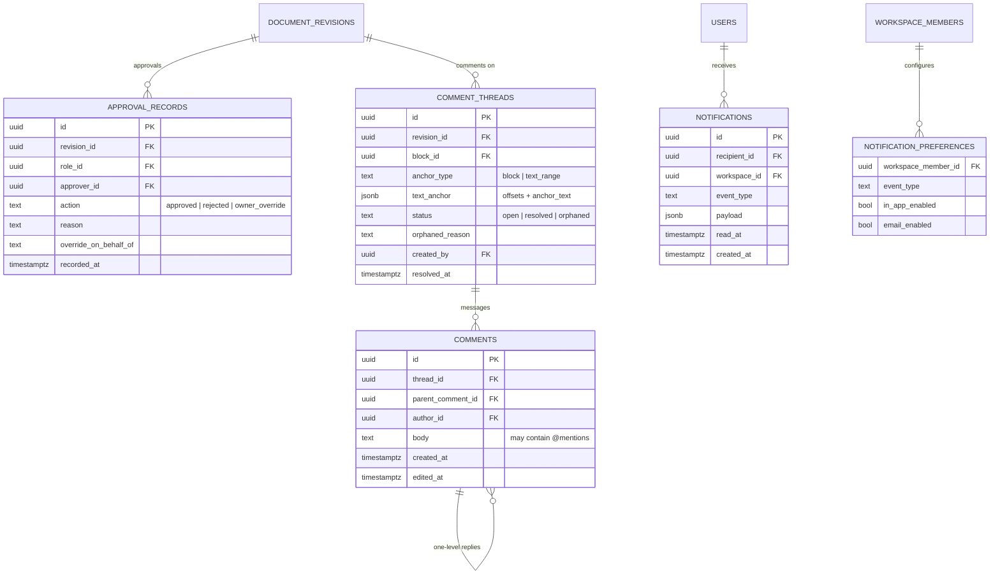
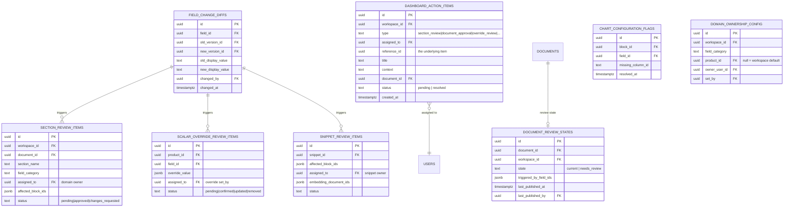
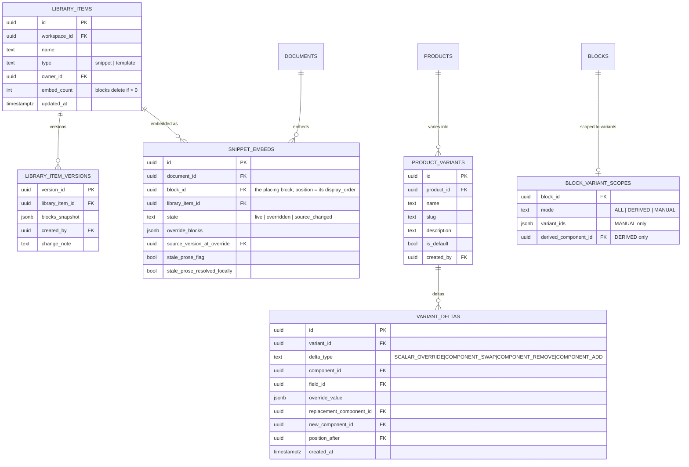
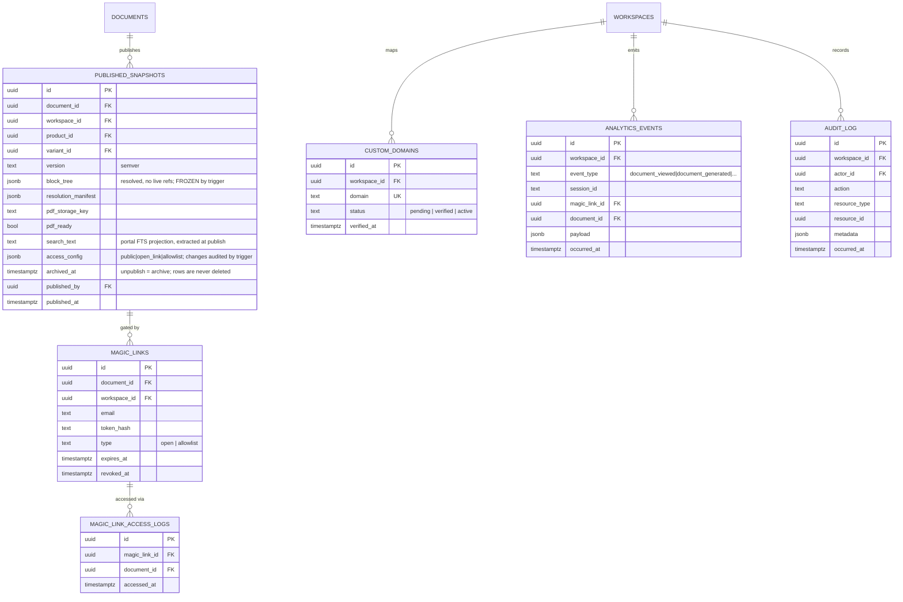

# Arther — Data Model & ERD

**Date:** 8 June 2026 · **Status:** Proposed · Companion to [`arther-architecture.md`](./arther-architecture.md) · [`arther-adrs.md`](./arther-adrs.md)

The data model translates the feature-spec entities into a Postgres schema for the architecture in [ADR-004](./arther-adrs.md#adr-004) / [ADR-005](./arther-adrs.md#adr-005). It is grouped into eight domains. Each ER diagram shows primary keys, foreign keys, and the columns that carry meaning; conventions and cross-cutting rules (tenancy, RLS, JSONB, immutability, indexing) follow in §10–§16.

Diagrams render in the markdown preview (Mermaid). Cross-domain foreign keys are marked `FK` and named so they read across diagrams even though Mermaid can't draw between them.

---

## 1. Domain map



Every tenant-scoped table carries `workspace_id` (the dashed tenancy edges). The arrows are the dominant data dependencies, matching the PRD build order.

---

## 2. Identity & Workspace

Decoupled auth ([ADR-010](./arther-adrs.md#adr-010), guardrail 3): provider identity in `auth_providers`, normalised app identity in `users`, role per workspace in `workspace_members`. Seat tier (Editor paid / Viewer free) is derived from role, not stored.



---

## 3. Spec Database

The graph: `products` and `components` are independent entities joined by `product_components` edges; product-specific values live on the edge (here as `product_component_overrides` rows for the override-review flow), never on the component. `spec_fields` may belong to a component or a product (PRD §7.1.1) via nullable `component_id`/`product_id` FKs with a one-owner CHECK (`num_nonnulls(component_id, product_id) = 1`) — real foreign keys rather than a polymorphic `owner_type`/`owner_id` pair, so the database enforces referential integrity and cascades. `field_versions` is append-only and powers staleness; `current_version_id` on the field points at the latest. `import_sessions` (not diagrammed) holds the multi-step import state: upload → interpretation → proposed mutations → per-row decisions → commit, so a refresh never loses the dry-run and committed decisions stay auditable.



Templates (`spec_templates`) are stored separately as scaffolds (built-in forkable + workspace-owned), holding their component/field structure as JSONB; they create real `components`/`spec_fields` on use.

---

## 4. Document Types, Briefs & Brand

Generation inputs. Document Types are generation schemas; sections declare which spec categories and brief fragment keys feed them. Briefs mirror the graph (attached to a product *or* a component). Brand Profiles and Quality Standards are separate concerns ([AI generator spec](../../Features/Spec%20Docs/arther-ai-document-generator.md)).



---

## 5. Documents & Blocks

A `document` is the logical entity; `document_revisions` carry lifecycle state and the working copy; `blocks` are the working-copy block tree (rich text as JSONB, with inline spec tokens inside `content` — the TipTap/ProseMirror document shape, [ADR-013](./arther-adrs.md#adr-013)). The three reference tables are the spine of Smart Spec Tracking and the source taxonomy.

Two operational tables accompany them (not diagrammed): `generation_runs` and `generation_run_sections` persist per-section generation state — the Realtime subscription target for live progress, the resume record for partial failure and section-level retry, and per-run token/cost accounting. Members read them; only the generation pipeline (service role) writes them, so runs cannot be forged from a client.

For in-app search, `blocks.text_content` holds the app-written plain-text projection of `content` (the rich-text tree isn't parseable by an immutable SQL function), with a generated `text_search tsvector` + GIN index over it.



---

## 6. Collaboration & Review

The four-state machine lives on `document_revisions.state`; approvals are AND-logic across `document_type_approval_roles`. Comments anchor to a block or a text range and can orphan. Notifications are the **one** delivery system for the whole product (invariant 8).



---

## 7. Smart Spec Tracking

Detection is a join over `block_spec_references`; the outputs are typed review items aggregated into `dashboard_action_items`. Domain ownership resolves through `domain_ownership_config` with the four-step fallback.



---

## 8. Content Reuse & Variants

Library items hold a self-contained block sequence (JSONB) with version history; `snippet_embeds` track live/overridden/source_changed state per embed. **Authoritative-source invariant:** the `blocks` row (`source='snippet'`, `snippet_id`) *is* the placement — position comes from `blocks.display_order`; `snippet_embeds` carries only state, keyed 1:1 to the placing block (`block_id`, unique). Variants are deltas from base ([variants spec](../../Features/Spec%20Docs/arther-product-variants.md)); resolved spec is computed at query time and cached in Redis (no table; [ADR-014](./arther-adrs.md#adr-014)).



---

## 9. Publishing, Portal & Analytics

`published_snapshots` are the only sanctioned copy of resolved spec values (invariants 1, 5): a frozen, versioned `block_tree` + `resolution_manifest` + pre-rendered PDF + access config + publish-time `search_text` (with a generated tsvector; portal search queries each document's latest non-archived snapshot only). Snapshots are created **only** by the publish pipeline (no authenticated INSERT policy — a client can't bypass the approval machine), members read, admins may update only the operational columns (freeze trigger), and rows are never deleted (no-delete trigger; unpublish = `archived_at`). Access-config changes and magic-link issuance/revocation write `audit_log` rows from database triggers. Magic links are member-readable but **editor**-issued (viewers cannot mint external access). Analytics and audit are append-only.



---

## 10. Tenancy & Row-Level Security

Every tenant-scoped table carries `workspace_id`. RLS policies restrict rows to the caller's workspaces via security-definer membership helpers, and writes are **role-aware** — the row mirrors the seat boundary, not just the tenant boundary:

```sql
-- the standard content-table pattern (members read, editors write)
alter table products enable row level security;

create policy products_read on products for select to authenticated
  using (private.is_workspace_member(workspace_id));

create policy products_write on products for all to authenticated
  using (private.is_workspace_editor(workspace_id))      -- owner/admin/member; NOT viewer
  with check (private.is_workspace_editor(workspace_id));
```

Four write tiers: **member** (viewers included) only where the specs grant viewers writes — comments and approval records; **editor** (`is_workspace_editor`) for all authoring content; **admin** for Settings surfaces (Document Types, Brand Profiles, quality standards, units, categories, domain ownership, custom domains, approval-role assignment); **service-role-only** (no authenticated write policy at all) for pipeline-owned tables — `published_snapshots` (insert/delete), `generation_runs`/`generation_run_sections`, `document_review_states`, `field_change_diffs`, `notifications`, `analytics_events`, `audit_log`.

The authenticated app connects with the user JWT, so RLS is active as defence in depth behind `canDo`. Background jobs and the portal use a service role that bypasses RLS — so they go through a thin data-access layer that **requires** an explicit `workspace_id` on every query (enforced by lint + tests). The portal only ever reads `published_snapshots`, which contain no live spec or draft data. The tenancy helpers exclude soft-deleted workspaces, so a deletion request hides the tenant everywhere at once.

---

## 11. JSONB vs. relational — the rule

Relational where we join, constrain, or audit; JSONB for irregular interiors:

| JSONB column | Holds | Why not relational |
|---|---|---|
| `spec_fields.value`, `field_versions.value` | the 8 typed `FieldValue` shapes | one column, eight shapes; validated by Zod |
| `blocks.content` | rich-text node tree incl. inline spec tokens | recursive, variable; queried as a tree, not by row |
| `product_component_overrides.value`, `variant_deltas.override_value` | a single field value | mirrors `FieldValue` |
| `published_snapshots.block_tree` | fully resolved block array | a frozen artifact, never queried piecemeal |
| `*.resolution_manifest`, `*.access_config`, `*.glossary`, `*.constraints` | structured config / provenance | schema-flexible, read whole |

Inline spec tokens inside `blocks.content` still create rows in `block_spec_references` so staleness stays a relational join — the JSONB holds presentation, the table holds the queryable relationship.

---

## 12. Immutability & history

Append-only (never updated or deleted in normal operation): `field_versions`, `approval_records`, `published_snapshots`, `product_releases` + `release_field_values`, `magic_link_access_logs`, `analytics_events`, `audit_log`. This is both a product requirement (field history powers staleness; approvals are an audit record) and a compliance control.

**Enforced, not conventional:** each of these combines (a) no mutating RLS policy for `authenticated` (default deny) with (b) `prevent_mutation()` / freeze triggers that stop even the **service role** — `approval_records` rejects update *and* delete; `published_snapshots` freezes content columns and rejects delete (unpublish = `archived_at`); releases freeze all but `notes`. Two documented carve-outs: `field_versions` may cascade-delete with a hard-deleted field (owner context only; the guards make that possible only at zero references), and the workspace purge job runs with `session_replication_role = replica`, which disables these triggers for the one sanctioned destruction path.

---

## 13. Archive vs. delete

Entities with dependents (`products`, `components`, `spec_fields`, `documents`, `document_types`, `brand_profiles`, library items) carry `archived_at`. Hard delete is allowed only at zero references — enforced by **BEFORE DELETE guard triggers** that check the referencing tables (`block_spec_references`, `product_components`, `variant_deltas`, releases, snapshots, embeds) and raise otherwise; these fire even on cascades, so the protection holds when app logic is bypassed (invariant 7). FK actions then divide by meaning: `on delete restrict` where a *sibling* must never be orphaned (`documents.product_id`, `published_snapshots.product_id`, edge→component, release values→field/version, embeds→library item), and `on delete cascade` for *owned* children, which is reachable only once the guards have said yes. The workspace root is the special case: no JWT delete path at all — soft delete + 14-day grace + purge job (§10).

---

## 14. Indexing essentials

| Purpose | Index |
|---|---|
| Staleness join | `block_spec_references (field_id, field_version_id)`; `(document_id)`; `(variant_id)` |
| Current value lookup | `spec_fields (current_version_id)`; `field_versions (field_id, changed_at desc)` |
| Tenancy filters | `workspace_id` on every tenant table (composite with the common sort key) |
| Graph traversal | `product_components (product_id, parent_component_id)`; `(component_id)` |
| Dashboard | `dashboard_action_items (assigned_to, status, created_at desc)` |
| Portal routing | `documents (workspace_id, slug)`; `published_snapshots (document_id, version)`; `custom_domains (domain)` |
| Search | GIN on `blocks.text_search` (in-app) and `published_snapshots.search_tsv` (portal) — both generated tsvectors over app-extracted text columns; `pg_trgm` GIN on `spec_fields.name` and `documents.title` for fuzzy |
| Generation/jobs | `generation_runs (workspace_id, created_at desc)`; `generation_run_sections (run_id, display_order)`; `document_revisions (review_due_date) where state='review'` for the reminders cron |
| Analytics | `analytics_events (workspace_id, event_type, occurred_at)`; partition by month at volume |

---

## 15. Conventions

- **IDs:** `uuid` (v7 preferred — time-ordered, index-friendly) primary keys everywhere.
- **Time:** `timestamptz`, UTC.
- **Attribution (guardrail 2):** `created_by`, `created_at`, `updated_by`, `updated_at` on every **mutable** entity from migration 1; append-only tables carry created-side attribution only (they never update); a few tables use domain-specific equivalents (`blocks.last_edited_by`, `overrides.set_by`, `domain_ownership_config.set_by`).
- **Soft-state:** `archived_at` (+ `archived_by`) rather than status enums where the lifecycle is archive/restore.
- **Migrations:** every schema change is a migration file (never a console edit); run and confirmed in a production-separate environment first.

---

## 16. What lives outside Postgres

- **Resolved variant spec** — computed at query time, cached in Redis (Upstash), invalidated on base-spec or delta change. Never a table (prevents silent divergence).
- **Local editor save queue** — client-side (browser), drains to the server on reconnect; not server state.
- **Files** — media, brand logos, and pre-rendered PDFs in Supabase Storage; rows hold storage keys, not blobs.
- **Live generation/job progress** — persisted per section in Postgres and streamed to the client via Realtime; the durable task is the source of truth.

---

*Arther — Data Model & ERD v0.2 (post-audit, 9 June 2026). ~60 entities across eight domains, Postgres with relational structure + JSONB interiors, role-aware RLS, trigger-enforced append-only history, archive-only lifecycle, and app-extracted FTS columns. Pairs with the architecture document and ADR set.*
